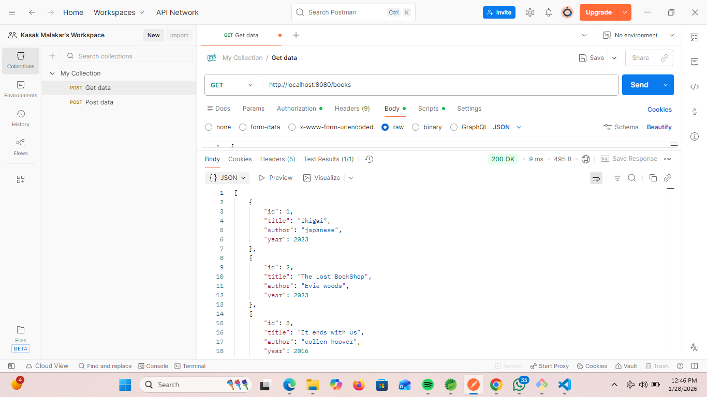

# Zimetrics-Task


# Zimetrics-Task
# In-Memory Library API

## 1. Project Title & Goal

A Spring Boot REST API that manages a library book inventory using strictly in-memory storage backed by a Java List.

## 2. Setup Instructions

Follow the steps below to run the project locally:

```bash
# Clone the repository
git clone 
cd <repo-folder-name>

# Build the project using Maven
mvn clean install

# Run the Spring Boot application
mvn spring-boot:run
```

Once the application is running, access:

* Base API URL: [http://localhost:8080](http://localhost:8080)
* Swagger UI (if enabled): [http://localhost:8080/swagger-ui.html](http://localhost:8080/swagger-ui.html)

## 3. The Logic (How you thought)

### Why did you choose this approach?

I used an in-memory `List` to store book objects because the problem statement explicitly restricted the use of databases or external storage. A List keeps the implementation simple and transparent while still allowing full CRUD operations through iteration and filtering.

Spring Boot was chosen for its clean REST support, annotation-based configuration, and ease of building production-style APIs. Using a List also clearly demonstrates how data can be manually searched, filtered, and managed without relying on frameworks like JPA.

### What was the hardest bug you faced, and how did you fix it?

The hardest challenge was ensuring unique book IDs when using a List. Since a List does not provide constant-time lookup like a Map, I initially faced issues with duplicate IDs being added.

I fixed this by iterating through the List before insertion to check whether a book with the same ID already exists and returning an appropriate HTTP error response if found.

Another issue was deleting a book safely while iterating over the List, which I resolved by using an iterator or filtering logic to avoid `ConcurrentModificationException`.

## 4. Output Screenshots

The following screenshots demonstrate successful API execution:

* POST /books – Successfully adding a new book
* GET /books/{id} – Retrieving book details
* GET /books/search?year=2024 – Filtering books by year
* DELETE /books/{id} – Removing a book

All screenshots are included in the `screenshots/` folder of this repository and were captured using Postman or Swagger UI.

## 5. Future Improvements

If I had 2 more days, I would:

* Replace the List with a database using Spring Data JPA
* Add update endpoints (PUT / PATCH)
* Add unit and integration tests using JUnit and Mockito
* Implement global exception handling with `@ControllerAdvice`
* Add pagination and sorting for better scalability


